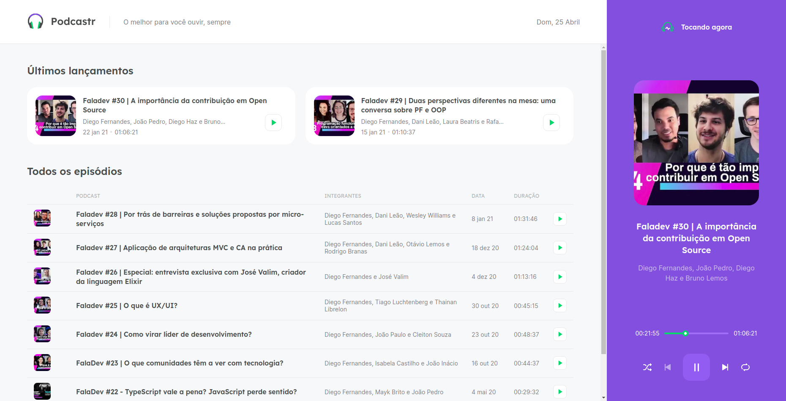
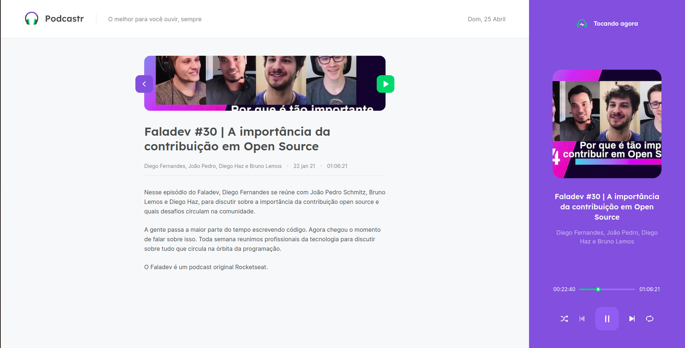

# Podcastr

Podcastr is a podcast platform built with React and Next.js during the Next Level Week #05 event hosted by Rocketseat.




## Getting Started
At the project root directory, follow the steps below:

```node
// Installing dependencies
$ yarn install

// Running project
$ yarn dev

// Running mock API
$ yarn server
```
## License
[MIT](https://choosealicense.com/licenses/mit/)
